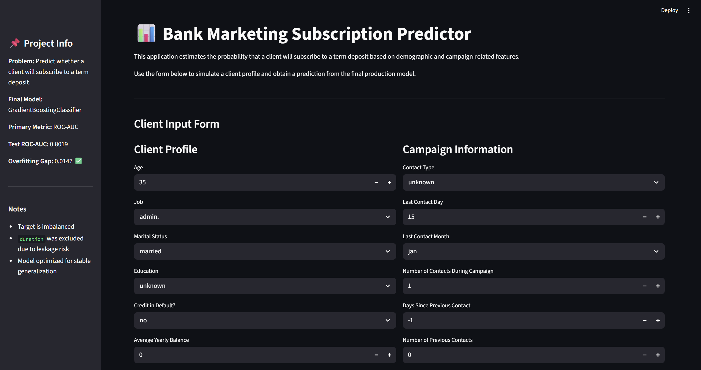

```markdown
# Bank Marketing Subscription Prediction — End-to-End ML System


---

## Live Application

👉 https://bank-marketing-app-71s8.onrender.com/

---

## Demo
```markdown

```

---

## Project Summary

This project implements a complete end-to-end Machine Learning system, covering the full lifecycle from data exploration to production deployment.

### Key capabilities:
- Data preprocessing with leakage control  
- Model training and evaluation  
- Hyperparameter tuning  
- Production-ready web app  
- Feedback logging system  
- Retraining pipeline  
- Docker containerization  
- Cloud deployment  

---

## Business Case

Banks conduct marketing campaigns to promote term deposits.

**The goal:**  
Predict which clients are most likely to subscribe *before* contacting them.

**Why it matters:**
- Reduce unnecessary calls  
- Increase conversion rate  
- Optimize campaign efficiency  

---

## Dataset Overview

- **Dataset:** Bank Marketing Dataset  
- **Samples:** 45,211  
- **Target:** `y` (yes/no)

### ⚠️ Challenges:
- Imbalanced dataset (~11.7% positive)  
- Presence of data leakage variable (`duration`)  
- High number of categorical features  

---

## System Architecture

```
User Input
   ↓
Streamlit App
   ↓
Preprocessing Pipeline
   ↓
Trained Model
   ↓
Prediction
   ↓
SQLite Logging
   ↓
Data Ingestion Pipeline
   ↓
Retraining Dataset
```

---

## Project Structure

```
.
├── app/                     # Streamlit app
├── data/
│   └── feedback/            # SQLite DB & retraining data
├── models/                  # Trained models
├── notebooks/               # EDA
├── reports/
│   ├── figures/
│   ├── metrics/
│   └── model_cards/
├── src/
│   ├── preprocessing/
│   ├── modeling/
│   └── monitoring/
├── tests/
├── Dockerfile
├── pyproject.toml
├── uv.lock
├── README.md
```

---

## Data Processing & Leakage Control

**Critical Decision:**  
❌ Removed `duration`  
- Known *after* the call  
- Causes data leakage  
- Makes model unrealistic  

### Additional Steps:
✔ Treated `"unknown"` as valid category  
✔ Stratified split  
✔ Pipeline-based transformations  

---

## Modeling Approach

### Models evaluated:
- DummyClassifier  
- Logistic Regression  
- Decision Tree  
- Random Forest  
- Gradient Boosting  
- HistGradientBoosting  

### Selection Criteria:
- ROC-AUC (primary)  
- Recall (minority class)  
- Overfitting control  

---

## Hyperparameter Tuning

- **Method:** RandomizedSearchCV  
- **CV:** Stratified K-Fold (5)  
- **Iterations:** 20  

### Final Model:
 **Tuned GradientBoostingClassifier**

---

## Final Model Performance

| Metric     | Value |
|------------|-------|
| ROC-AUC    | 0.805 |
| F1 Score   | 0.381 |
| Recall     | 0.269 |
| Precision  | 0.648 |
| Accuracy   | 0.897 |
| Gap        | 0.049 |

---

## Interpretation

- Strong ranking ability (ROC-AUC > 0.80)  
- Balanced precision/recall  
- Controlled overfitting  

---

## Baseline Comparison

Outperformed:
- Logistic Regression  
- Decision Tree  
- Random Forest  
- Dummy baseline  

---

## Testing

Tests implemented:
- ✔ Leakage validation  
- ✔ Stratified split  
- ✔ Feature validation  
- ✔ Minimum performance thresholds  

Run:
```
uv run pytest
```

---

## Web Application

Built with **Streamlit**

### Features:
- Input form  
- Prediction output  
- Probability interpretation  
- User-friendly interface  

---

## Logging & Monitoring

Each prediction logs:
- Inputs  
- Prediction  
- Probability  
- Timestamp  

**Storage:** SQLite database

---

## Retraining Pipeline

- Extract labeled feedback  
- Build retraining dataset  
- Enable future improvements  

---

## Run Locally

```
uv sync
uv run streamlit run app/app.py
```

---

## Run with Docker

```
docker build -t bank-marketing-app .
docker run -p 8501:8501 bank-marketing-app
```

---

## Deployment

Platform: **Render**

👉 https://bank-marketing-app-71s8.onrender.com/

Features:
- Docker deployment  
- Auto CI/CD  
- Public access  

---

## ML Engineering Concepts Applied

- Leakage prevention  
- Reproducible pipelines  
- Cross-validation  
- Model selection  
- Hyperparameter tuning  
- Monitoring & logging  
- Testing  
- Containerization  
- Deployment  

---

## Limitations

- No automatic feedback labeling  
- No real-time retraining  
- No drift detection  

---

## Future Work

- SHAP explainability  
- Drift detection  
- Automated retraining  
- Threshold tuning  
- A/B testing  

---

## Tech Stack

- Python  
- Pandas / NumPy  
- Scikit-learn  
- Streamlit  
- SQLite  
- Docker  
- Render  
- Pytest  
- UV  

---

## 📬 Contact

GitHub:  
https://github.com/Andres-Torrez